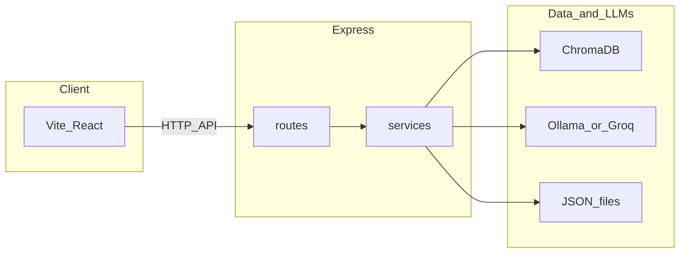

# 코니 (Connie)

**Connie**는 *Company Helper & AI Virtual Interactive Service*의 약칭이며, **콘센트릭스(Concentrix)** 브랜드 앞부분 **「Con」**을 따 지은 이름이 **코니(Connie)**이다. 등록된 사내 지식을 기준으로 질문에 답하는 **챗봇 프로토타입**이다.

---

## 1. 과제 개요 및 기획 의도

신규 입사자와 사내 정보가 필요한 구성원은 규정·복지·사무 환경 안내가 문서·메신저·구두로 흩어져 있어 탐색에 시간이 든다. 동시에 인사·총무 등 지원 부서에는 유사 문의가 반복된다. **Connie**는 등록된 사내 지식을 우선해 답하고, 의미 검색과 자연어 생성으로 탐색 시간을 줄이며, 관리자가 지식을 보강할 수 있는 **운영 가능한 프로토타입**을 목표로 한다.

---

## 2. 서비스 개요

Connie는 웹 챗봇 UI와 REST API, 관리자 화면으로 구성된다. 사용자는 질문을 입력하거나 FAQ 칩을 선택하고, 서버는 규칙 매칭·벡터 검색·언어 모델을 순서대로 거쳐 JSON으로 답변을 돌려준다. 관리자는 동일 서버의 `admin.html`에서 지식·FAQ·미답변·파일을 다룬다.

**핵심 기능을 한 줄로 정리하면 다음과 같다.**

- **Exact Match**: 자주 나오는 질의는 키워드 포함 여부만으로 즉시 응답(LLM 미사용).
- **RAG**: ChromaDB 의미 검색으로 가져온 문단을 프롬프트에 넣어 답을 생성하며, API·채팅 UI에 근거 문단 배열 `sources`를 제공한다(RAG일 때 접이식 블록).
- **미매칭 처리**: 사내 검색 결과가 없으면 미답변 로그를 남기고, 일반 지식 모드로 LLM을 호출할 수 있으며 이때 면책 문구를 붙인다.
- **운영**: 지식 CRUD 시 JSON과 Chroma 컬렉션을 함께 갱신하고, FAQ 칩·미답변 목록·업로드·도메인 제한 가입·승인 흐름을 제공한다.

### 2.1 배포 데모 URL·테스트 계정

과제·스터디 검증용으로 올려 둔 주소는 다음과 같다.

| 구분 | URL |
|------|-----|
| 챗봇 | [https://2026-01-chatbot.vercel.app/](https://2026-01-chatbot.vercel.app/) |
| 관리자 | [https://two026-01-chatbot-1.onrender.com/admin.html](https://two026-01-chatbot-1.onrender.com/admin.html) |

**테스트 계정**(관리자 로그인): 이메일 `connie.test@concentrix.com`(화면에서 `@concentrix.com`이 고정이면 앞부분만 `connie.test`), 비밀번호 `123456789`. 이 계정은 서버 설정상 **최고 관리자(superadmin)** 로 간주되어 **가입 즉시 활성·로그인**되며, **다른 관리자 가입 승인·거절**도 할 수 있다. 이미 `pending`으로만 남아 있다면 **서버를 한 번 재시작**하면 동일 권한으로 승격된다.

---

## 3. 시스템 동작 및 AI 설계

### 3.1 질문 1건에 대한 처리 순서

서버는 [server/routes/chat.js](server/routes/chat.js)에서 아래 순서를 따른다. 필드 정의는 [docs/features/01-chat-pipeline.md](docs/features/01-chat-pipeline.md)에 맡긴다.

1. **Exact Match** — 질문 문자열에 등록된 키워드가 포함되면 해당 답·링크·첨부를 반환하고 종료한다(`type`: `exact_match`).
2. **ChromaDB 의미 검색** — 설정값 `RAG_TOP_K`(기본 5)만큼 문서를 조회한다.
3. **검색 0건** — 미답변 로그에 남긴 뒤, 일반 지식용 LLM 호출을 시도한다(`type`: `no_match`, 필요 시 `disclaimer`).
4. **검색 1건 이상** — 문단을 `[사내 지식]` 블록으로 이어 붙여 RAG 프롬프트로 LLM을 호출한다(`type`: `rag`, `sources`에 근거).

### 3.2 사용 모델과 제공자

| 구분 | 내용 |
|------|------|
| 기본 | **Ollama**, 모델 기본값 `llama3:latest`(`OLLAMA_MODEL`로 변경). |
| 선택 | `GROQ_API_KEY`가 있으면 **Groq** OpenAI 호환 API로 전환, 기본 `GROQ_MODEL`은 `llama-3.3-70b-versatile`. |

생성 로직은 [server/services/ollama.js](server/services/ollama.js)에서 Ollama와 Groq를 동일 인터페이스로 호출한다.

### 3.3 AI의 역할과 비-AI 구간

- **LLM이 담당하는 부분**: 검색된 사내 문맥을 바탕으로 한 **답변 문장화·요약**(RAG), 사내 지식이 없을 때의 **보조 안내**(일반 지식 모드, 면책 문구 `GENERAL_KNOWLEDGE_DISCLAIMER` 동반).
- **LLM을 쓰지 않는 부분**: Exact Match에 걸린 질문은 `exact-match-knowledge.json` 규칙만으로 응답한다.

### 3.4 프롬프트 설계 요지

- **RAG**: 역할을 사내 지식 가이드 챗봇으로 고정하고, 주어진 `[사내 지식]`만 근거로 삼도록 지시한다. 없는 내용은 고정 안내로 인사·총무 문의를 유도한다.
- **일반 지식(미매칭)**: 일반 지식 범위에서 짧게 한국어로 답하되, 모르면 인사·총무 문의만 하도록 제한한다.

### 3.5 배포·기밀 관련 유의점

로컬에서 Ollama만 쓰면 질문과 검색 문맥이 **외부 LLM 업체로 나가지 않도록** 구성하기 쉽다. 반면 **Groq를 켜면** RAG·일반 지식 모두에서 **질문과 프롬프트에 실린 텍스트가 Groq로 전송**되므로, 기밀 취급 정책에 맞는지 별도 판단이 필요하다.

---

## 4. 기술 아키텍처

### 4.1 기술 스택

- **Frontend**: React 19, Vite, Tailwind CSS  
- **Backend**: Node.js(Express), ES Modules  
- **검색·저장**: ChromaDB(`chromadb` 패키지, 로컬 서버 또는 Chroma Cloud)  
- **생성**: Ollama(로컬) 또는 Groq(API)

### 4.2 구성도

UI와 API를 분리해 프론트는 Vercel 등, API는 Railway 등에 올리기 쉽게 했다. 검색은 Chroma 임베딩, 생성은 단일 서비스 모듈에서 제공자만 바꾼다.



### 4.3 디렉터리 구조

```
2026_01_chatbot/
├── client/                 # 챗봇 UI (App.jsx, hooks, components)
├── server/
│   ├── index.js            # 앱 진입, 라우트·정적 파일
│   ├── config.js
│   ├── ingest.js
│   ├── routes/             # chat, auth, faq, knowledge, upload, unanswered, ollama
│   ├── services/         # chroma, ollama, knowledge, faq, admin*, unanswered
│   ├── middleware/
│   ├── public/             # admin.html 등
│   ├── data/               # exact-match, faq, admin-users, unanswered 등
│   └── uploads/
├── teams/                  # Teams 개인 탭용 매니페스트·아이콘(zip 패키지 원본)
├── docs/features/          # 파이프라인·기능별 상세
├── DEPLOY.md
└── README.md
```

---

## 5. 구현 범위(프로토타입)

| 영역 | 상태 | 비고 |
|------|------|------|
| React(Vite) 챗봇 UI | 완료 | [client/src/App.jsx](client/src/App.jsx), [useChat.js](client/src/hooks/useChat.js), [useFaq.js](client/src/hooks/useFaq.js) |
| `POST /api/chat` | 완료 | `exact_match` / `rag` / `no_match` |
| Chroma·ingest | 완료 | [server/ingest.js](server/ingest.js), [server/services/chroma.js](server/services/chroma.js) |
| Ollama·Groq | 완료 | [server/services/ollama.js](server/services/ollama.js) |
| Exact Match·미답변 | 완료 | [knowledge.js](server/services/knowledge.js), [unanswered.js](server/services/unanswered.js) |
| 관리자 UI·보호 API | 완료 | [server/public/admin.html](server/public/admin.html), 쿠키 세션 |
| 배포 문서 | 완료 | [DEPLOY.md](./DEPLOY.md) |

데모 전에는 Chroma 접속, Ollama 실행 또는 `GROQ_API_KEY` 설정이 필요하다. CORS는 `ALLOWED_ORIGINS`와 환경별 기본 origin으로 제한된다.

---

## 6. 사용자 경험(UX)

**일반 사용자** — 빈 상태 안내 후 FAQ 칩 또는 직접 입력으로 질문한다. 응답으로 본문, 답변 유형 라벨, 관련 링크·첨부, 일반 지식일 때 면책 문구를 본다. RAG(`type: rag`)일 때는 **「참고한 사내 문단」** 접이식 블록에서 `sources` 근거 문단을 확인할 수 있다([useChat.js](client/src/hooks/useChat.js), [ChatMessage.jsx](client/src/components/ChatMessage.jsx)).

**관리자** — `http://<서버 호스트>/admin.html`에 접속해, [server/config.js](server/config.js)의 `ADMIN_EMAIL_DOMAIN`(기본 `concentrix.com`) 이메일로 가입·로그인한다. 최초 한 명은 최고 관리자로 부트스트랩된다. 이후 지식·FAQ·미답변·업로드를 관리한다.

---

## 7. API·데이터

### 7.1 엔드포인트 요약

| 메서드 | 경로 | 설명 | 인증 |
|--------|------|------|------|
| GET | `/health` | 헬스체크 | 불필요 |
| GET | `/` | API 안내 JSON | 불필요 |
| POST | `/api/chat` | 챗봇 (`body`: `{ "question": "..." }`) | 불필요 |
| GET | `/api/ollama-status` | LLM 상태(`?test=chat` 시 간이 호출) | 불필요 |
| GET | `/api/faq` | FAQ 칩 | 불필요 |
| PUT | `/api/faq` | FAQ 저장 | 관리자 |
| POST | `/api/auth/register`, `/login`, `/logout` | 가입·로그인·로그아웃 | 쿠키 |
| GET | `/api/auth/me` | 세션 | 쿠키 |
| GET | `/api/auth/pending-registrations` | 가입 대기 | 최고 관리자 |
| POST | `/api/auth/approve-registration`, `/reject-registration` | 승인·거절 | 최고 관리자 |
| GET·POST·PUT·DELETE | `/api/knowledge` | 지식 CRUD(JSON + **Chroma 동기화**) | 관리자 |
| GET | `/api/unanswered` | 미답변 목록 | 관리자 |
| DELETE | `/api/unanswered/:id` | 미답변 개별 삭제 | 관리자 |
| DELETE | `/api/unanswered/bulk` | 일괄 삭제(`body.ids` 선택, 없으면 전체 비움) | 관리자 |
| POST | `/api/upload` | 파일 업로드 | 관리자 |
| — | `/admin.html` | 관리자 UI | 로그인 후 |

### 7.2 `POST /api/chat` 응답 타입

- `exact_match` — 키워드 매칭, `matchedKeyword` 등  
- `rag` — Chroma 근거 + LLM, `sources` 배열  
- `no_match` — 검색 0건, 일반 지식 또는 폴백, `generalKnowledge`·`disclaimer` 등  

### 7.3 지식 데이터와 벡터 동기화

- 초기 적재: `cd server && node ingest.js` → 컬렉션 `company_knowledge`([config.js](server/config.js)의 `COLLECTION_NAME`).
- 운영 편집: 원본은 `server/data/exact-match-knowledge.json`이며, 관리자 API로 추가·수정·삭제할 때 [server/routes/knowledge.js](server/routes/knowledge.js)가 Chroma에도 반영을 시도한다. Chroma 쓰기가 실패해도 JSON만 갱신될 수 있으므로 로그 확인이 필요하다.

---

## 8. 설치·실행·배포

**저장소·의존성**

```bash
git clone <repository-url>
cd 2026_01_chatbot
cd server && npm install
cd ../client && npm install
```

**Chroma(로컬 예시)**

```bash
pip install chromadb
chroma run
```

기본 `http://localhost:8000`. 원격은 `CHROMA_URL` 등으로 지정한다.

**Ollama(로컬 LLM)**

```bash
brew install ollama   # 또는 https://ollama.ai
ollama pull llama3
```

**실행**

```bash
# 터미널 1
cd server && npm run start          # http://localhost:3001

# 터미널 2
cd client && npm run dev             # http://localhost:5173
```

**배포**: [DEPLOY.md](./DEPLOY.md)  
**Microsoft Teams 탭**(웹 URL을 개인 탭으로 열기): [teams/README.md](./teams/README.md)

**Teams와 스터디 제출**

- **현재 상태**: 조직 Microsoft Teams에 커스텀 앱(코니) 패키지 **제출까지 완료**했으며, 테넌트 정책에 따라 **IT 관리자 승인 대기(Pending)** 중이다. 승인·게시 후에는 스토어의 **조직용 빌드** 등에서 구성원이 설치할 수 있다.
- **스터디 제출**: 과제·데모는 배포된 **웹 URL**과 본 README·`DEPLOY.md`로 검증하면 되며, Teams는 위와 같이 **승인 대기**여도 제출·평가와 별개로 둘 수 있다.
- **참고(매니페스트·조직 정책)**: 승인·게시 이후 **배포 URL**이 바뀌거나, 테넌트에서 요구하는 **도메인 허용(`validDomains`)·정책 URL** 등이 달라지면 [teams/manifest.json](./teams/manifest.json)을 그에 맞게 고친 뒤 [teams/README.md](./teams/README.md) 절차대로 zip을 다시 만들어 제출할 수 있다. 제출·승인·게시 방식은 **조직마다 다르므로** 필요 시 내부 IT 또는 Teams 관리 안내를 확인하면 된다. 웹 앱만 사용하는 경우에는 **Teams 연동만을 이유로 앱 코드를 당장 수정할 필수는 없다.**

**macOS Chrome(서버 폴더에서)**

```bash
cd server
npm run start:new
# 또는 API만 열기: npm run open:chrome  → localhost:3001
```

---

## 9. 환경 변수

| 변수 | 설명 |
|------|------|
| `PORT` | 기본 `3001` |
| `NODE_ENV` | `production` 시 CORS 기본값 등 |
| `OLLAMA_MODEL` | 기본 `llama3:latest` |
| `OLLAMA_HOST` | 기본 `http://127.0.0.1:11434` |
| `OLLAMA_TIMEOUT_MS` | 기본 `120000` |
| `GROQ_API_KEY` | 설정 시 Groq 사용 |
| `GROQ_MODEL` | 기본 `llama-3.3-70b-versatile` |
| `ALLOWED_ORIGINS` | CORS, 쉼표 구분 |
| `CHROMA_URL` / `CHROMA_HOST`·`CHROMA_PORT`·`CHROMA_SSL` | Chroma 연결 |
| `CHROMA_API_TOKEN` | Chroma Cloud 등 |
| `SUPERADMIN_EMAILS` | 쉼표로 여러 개. **추가**로 최고 관리자 승격 대상에 넣음(비워도 `connie.test@…` 데모는 기본 포함). |
| `DISABLE_DEMO_SUPERADMIN` | `1` 또는 `true`이면 `connie.test` 자동 승격을 끄고, `SUPERADMIN_EMAILS`만 사용(운영 잠금용). |

관리자 이메일 도메인은 환경 변수가 아니라 [server/config.js](server/config.js)의 `ADMIN_EMAIL_DOMAIN`에서 수정한다.

```bash
cd server
PORT=3002 OLLAMA_MODEL=llama3:latest npm run start
```

---

## 10. 차별성·향후 계획·참고 문서

**차별성**은 “Exact Match로 지연·비용을 줄이고, RAG로 표현 다양성을 흡수하며, 미답변과 관리자 CRUD로 운영 루프를 닫는다”는 점에 있다. 아이디어 자체보다 **문제 해결 방식과 실행 가능한 프로토타입**에 무게를 둔다.

**향후(로드맵)**

- [ ] 임베딩·검색 품질 튜닝  
- [ ] 미답변을 지식으로 반영하는 자동화(알림 등)  

**상세 기술 문서**(README는 요약만 유지)

- [docs/features/01-chat-pipeline.md](docs/features/01-chat-pipeline.md) — 처리 순서·응답 필드  
- [docs/features/03-chromadb-rag.md](docs/features/03-chromadb-rag.md), [04-ollama.md](docs/features/04-ollama.md)  
- [docs/features/09-admin-panel.md](docs/features/09-admin-panel.md), [11-admin-auth.md](docs/features/11-admin-auth.md)  

---
