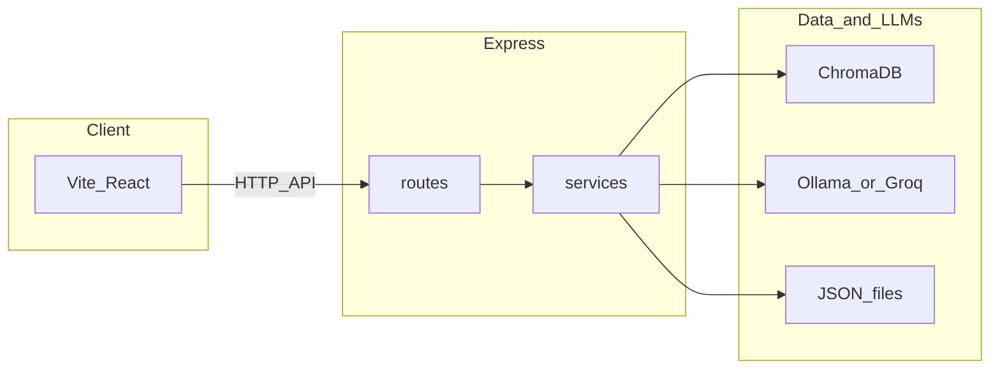

# 코니 (Connie)

**Connie** — *Company Helper & AI Virtual Interactive Service* 약칭, **콘센트릭스(Concentrix)** 브랜드 앞 **「Con」**에서 따 온 이름 **코니(Connie)**. 등록된 사내 지식 기준 질문 응답 **챗봇 프로토타입**.

---

## 1. 과제 개요 및 기획 의도

신규 입사자·사내 정보 필요 구성원: 규정·복지·사무 환경 안내가 문서·메신저·구두에 분산 → **탐색 시간 소요**. 인사·총무 등: **유사 문의 반복**.

**Connie** 목표: 등록 사내 지식 우선 응답, 의미 검색·자연어 생성으로 탐색 시간 단축, 관리자 지식 보강 가능한 **운영 가능한 프로토타입**.

---

## 2. 서비스 개요

**구성**: 웹 챗봇 UI, REST API, 관리자 화면.

**사용자**: 질문 입력 또는 FAQ 칩 선택.

**서버**: 규칙 매칭 → 벡터 검색 → 언어 모델 순 처리 후 JSON 답변.

**관리자**: 동일 서버 `admin.html`에서 지식·FAQ·미답변·파일 관리.

**핵심 기능 요약**

- **Exact Match**: 빈번 질의 — 키워드 포함 여부만으로 즉시 응답(LLM 미사용).
- **RAG**: ChromaDB 검색 문단을 프롬프트에 넣어 답 생성, API·채팅 UI에 근거 문단 배열 `sources` 제공(RAG 시 접이식 블록).
- **미매칭**: 사내 검색 0건 시 미답변 로그, 일반 지식 모드 LLM 호출 가능, 면책 문구 부착.
- **운영**: 지식 CRUD 시 JSON·Chroma 컬렉션 동시 갱신, FAQ 칩·미답변·업로드·도메인 제한 가입·승인 흐름.

### 2.1 배포 데모 URL·테스트 계정

- **챗봇** — [https://2026-01-chatbot.vercel.app/](https://2026-01-chatbot.vercel.app/)
- **관리자** — [https://two026-01-chatbot-1.onrender.com/admin.html](https://two026-01-chatbot-1.onrender.com/admin.html)

**테스트 계정**(관리자 로그인): 이메일 `connie.test@concentrix.com`, 비밀번호 `123456789`.

서버 설정상 **최고 관리자(superadmin)** 간주, **가입 즉시 활성·로그인**, **타 관리자 가입 승인·거절** 가능. 기존 `pending`만 남은 경우 **서버 재시작 시 동일 권한 승격**.

---

## 3. 시스템 동작 및 AI 설계

### 3.1 질문 1건에 대한 처리 순서

처리 로직: [server/routes/chat.js](server/routes/chat.js). 
필드 정의: [docs/features/01-chat-pipeline.md](docs/features/01-chat-pipeline.md) 

1. **Exact Match** — 질문 문자열에 등록 키워드 포함 시 해당 답·링크·첨부 반환 후 종료(`type`: `exact_match`).
2. **ChromaDB 의미 검색** — 설정값 `RAG_TOP_K`(기본 5)만큼 문서 조회.
3. **검색 0건** — 미답변 로그 기록 후 일반 지식용 LLM 호출 시도(`type`: `no_match`, 필요 시 `disclaimer`).
4. **검색 1건 이상** — 문단을 `[사내 지식]` 블록으로 연결해 RAG 프롬프트로 LLM 호출(`type`: `rag`, `sources`에 근거).

### 3.2 사용 모델과 제공자

- **기본** — **Ollama**, 모델 기본값 `llama3:latest`(`OLLAMA_MODEL`로 변경).
- **선택** — `GROQ_API_KEY` 존재 시 **Groq** OpenAI 호환 API, 기본 `GROQ_MODEL`은 `llama-3.3-70b-versatile`.

생성 로직: [server/services/ollama.js](server/services/ollama.js) — Ollama·Groq 동일 인터페이스 호출.

### 3.3 AI의 역할과 비-AI 구간

- **LLM 담당**: 검색 사내 문맥 기반 **답변 문장화·요약**(RAG), 사내 지식 없을 때 **보조 안내**(일반 지식 모드, 면책 문구 `GENERAL_KNOWLEDGE_DISCLAIMER` 동반).
- **LLM 미사용**: Exact Match 적중 질문 — `exact-match-knowledge.json` 규칙만으로 응답.

### 3.4 프롬프트 설계 요지

- **RAG**: 역할 고정(사내 지식 가이드 챗봇), `[사내 지식]`만 근거. 미포함 내용은 고정 안내로 인사·총무 문의 유도.
- **일반 지식(미매칭)**: 일반 지식 범위·짧은 한국어, 불가 시 인사·총무 문의만.

### 3.5 배포·기밀 관련 유의점

로컬 Ollama 단독 사용 시 질문·검색 문맥 **외부 LLM 업체 미전송** 구성 용이. **Groq 사용 시** RAG·일반 지식 모두 **질문·프롬프트 텍스트 Groq 전송** — 기밀 정책 별도 검토 필요.

---

## 4. 기술 아키텍처

### 4.1 기술 스택

- **Frontend**: React 19, Vite, Tailwind CSS  
- **Backend**: Node.js(Express), ES Modules  
- **검색·저장**: ChromaDB(`chromadb` 패키지, 로컬 서버 또는 Chroma Cloud)  
- **생성**: Ollama(로컬) 또는 Groq(API)

### 4.2 구성도

UI·API 분리 — 프론트 Vercel 등, API Railway 등 배포 용이. 검색: Chroma 임베딩, 생성: 단일 서비스 모듈에서 제공자 교체.



### 4.3 디렉터리 구조

```
2026_01_chatbot/
├── client/                 # 챗봇 UI (App.jsx, hooks, components)
├── server/
│   ├── index.js            # 앱 진입, 라우트·정적 파일
│   ├── config.js
│   ├── ingest.js
│   ├── routes/             # chat, auth, faq, knowledge, upload, unanswered, ollama
│   ├── services/         # chroma, ollama, knowledge, faq, admin*, unanswered
│   ├── middleware/
│   ├── public/             # admin.html 등
│   ├── data/               # exact-match, faq, admin-users, unanswered 등
│   └── uploads/
├── teams/                  # Teams 개인 탭용 매니페스트·아이콘(zip 패키지 원본)
├── docs/
│   ├── FEATURES-INDEX.md   # 기능별 문서 목차 (루트 README와 구분)
│   └── features/           # 파이프라인·기능별 상세
├── DEPLOY.md
└── README.md
```

---

## 5. 구현 범위(프로토타입)

- **React(Vite) 챗봇 UI** — 완료 — [client/src/App.jsx](client/src/App.jsx), [useChat.js](client/src/hooks/useChat.js), [useFaq.js](client/src/hooks/useFaq.js)
- **`POST /api/chat`** — 완료 — `exact_match` / `rag` / `no_match`
- **Chroma·ingest** — 완료 — [server/ingest.js](server/ingest.js), [server/services/chroma.js](server/services/chroma.js)
- **Ollama·Groq** — 완료 — [server/services/ollama.js](server/services/ollama.js)
- **Exact Match·미답변** — 완료 — [knowledge.js](server/services/knowledge.js), [unanswered.js](server/services/unanswered.js)
- **관리자 UI·보호 API** — 완료 — [server/public/admin.html](server/public/admin.html), 쿠키 세션
- **배포 문서** — 완료 — [DEPLOY.md](./DEPLOY.md)

데모 전 **전제**: Chroma 접속, Ollama 실행 또는 `GROQ_API_KEY` 설정. CORS: `ALLOWED_ORIGINS`·환경별 기본 origin으로 제한.

---

## 6. 사용자 경험(UX)

**일반 사용자** — 빈 상태 안내 → FAQ 칩 또는 직접 입력. 응답: 본문, 답변 유형 라벨, 링크·첨부, 일반 지식 시 면책 문구. RAG(`type: rag`) 시 **「참고한 사내 문단」** 접이식 블록에서 `sources` 확인([useChat.js](client/src/hooks/useChat.js), [ChatMessage.jsx](client/src/components/ChatMessage.jsx)).

**관리자** — `http://<서버 호스트>/admin.html`(배포 예: [관리자 화면](https://two026-01-chatbot-1.onrender.com/admin.html)), [server/config.js](server/config.js)의 `ADMIN_EMAIL_DOMAIN`(기본 `concentrix.com`)으로 가입·로그인. 최초 1인 **최고 관리자 부트스트랩**. 이후 지식·FAQ·미답변·업로드 관리. **챗봇 열기** → 배포 챗봇 [Vercel](https://2026-01-chatbot.vercel.app/).

---

## 7. API·데이터

### 7.1 엔드포인트 요약

- `GET` `/health` — 헬스체크 — 인증 불필요
- `GET` `/` — API 안내 JSON — 인증 불필요
- `POST` `/api/chat` — 챗봇 (`body`: `{ "question": "..." }`) — 인증 불필요
- `GET` `/api/ollama-status` — LLM 상태(`?test=chat` 시 간이 호출) — 인증 불필요
- `GET` `/api/faq` — FAQ 칩 — 인증 불필요
- `PUT` `/api/faq` — FAQ 저장 — 관리자
- `POST` `/api/auth/register`, `/login`, `/logout` — 가입·로그인·로그아웃 — 쿠키
- `GET` `/api/auth/me` — 세션 — 쿠키
- `GET` `/api/auth/pending-registrations` — 가입 대기 — 최고 관리자
- `POST` `/api/auth/approve-registration`, `/reject-registration` — 승인·거절 — 최고 관리자
- `GET`·`POST`·`PUT`·`DELETE` `/api/knowledge` — 지식 CRUD(JSON + **Chroma 동기화**) — 관리자
- `GET` `/api/unanswered` — 미답변 목록 — 관리자
- `DELETE` `/api/unanswered/:id` — 미답변 개별 삭제 — 관리자
- `DELETE` `/api/unanswered/bulk` — 일괄 삭제(`body.ids` 선택, 없으면 전체 비움) — 관리자
- `POST` `/api/upload` — 파일 업로드 — 관리자
- `/admin.html` — 관리자 UI — 로그인 후

### 7.2 `POST /api/chat` 응답 타입

- `exact_match` — 키워드 매칭, `matchedKeyword` 등  
- `rag` — Chroma 근거 + LLM, `sources` 배열  
- `no_match` — 검색 0건, 일반 지식 또는 폴백, `generalKnowledge`·`disclaimer` 등  

### 7.3 지식 데이터와 벡터 동기화

- 초기 적재: `cd server && node ingest.js` → 컬렉션 `company_knowledge`([config.js](server/config.js)의 `COLLECTION_NAME`).
- 운영 편집: 원본 `server/data/exact-match-knowledge.json`, 관리자 API CRUD 시 [server/routes/knowledge.js](server/routes/knowledge.js) Chroma 반영 **시도**. Chroma 쓰기 실패 시 JSON만 갱신 **가능**·로그 확인 **권장**.

---

## 8. 설치·실행·배포

**저장소·의존성**

```bash
git clone <repository-url>
cd 2026_01_chatbot
cd server && npm install
cd ../client && npm install
```

**Chroma(로컬 예시)**

```bash
pip install chromadb
chroma run
```

기본 주소 `http://localhost:8000`. 원격: `CHROMA_URL` 등 지정.

**Ollama(로컬 LLM)**

```bash
brew install ollama   # 또는 https://ollama.ai
ollama pull llama3
```

**실행**

```bash
# 터미널 1
cd server && npm run start          # http://localhost:3001

# 터미널 2
cd client && npm run dev             # http://localhost:5173
```

**배포**: [DEPLOY.md](./DEPLOY.md)  
**Microsoft Teams 탭**(웹 URL 개인 탭): [teams/README.md](./teams/README.md)

**Teams와 스터디 제출**

- **현재 상태**: 조직 Microsoft Teams 커스텀 앱(코니) 패키지 **제출 완료**, 테넌트 정책에 따라 **IT 관리자 승인 대기(Pending)**. 승인·게시 완료 후 스토어 **조직용 빌드** 등 경로의 구성원 설치 **가능에 대한 기대**. 최종 여부 확정은 테넌트 정책·관리자 처리 **에 따름**.
- **스터디 제출**: 과제·데모 검증 — 배포 **웹 URL**, 본 README·`DEPLOY.md`.


**macOS Chrome(서버 폴더에서)**

```bash
cd server
npm run start:new
# 또는 API만: npm run open:chrome  → localhost:3001
```

---

## 9. 환경 변수

- `PORT` — 기본 `3001`
- `NODE_ENV` — `production` 시 CORS 기본값 등
- `OLLAMA_MODEL` — 기본 `llama3:latest`
- `OLLAMA_HOST` — 기본 `http://127.0.0.1:11434`
- `OLLAMA_TIMEOUT_MS` — 기본 `120000`
- `GROQ_API_KEY` — 설정 시 Groq 사용
- `GROQ_MODEL` — 기본 `llama-3.3-70b-versatile`
- `ALLOWED_ORIGINS` — CORS, 쉼표 구분
- `CHROMA_URL` / `CHROMA_HOST`·`CHROMA_PORT`·`CHROMA_SSL` — Chroma 연결
- `CHROMA_API_TOKEN` — Chroma Cloud 등
- `SUPERADMIN_EMAILS` — 쉼표 구분 **추가** 최고 관리자 승격 대상(비워도 `connie.test@…` 데모 기본 포함).
- `DISABLE_DEMO_SUPERADMIN` — `1` 또는 `true` — `connie.test` 자동 승격 off, `SUPERADMIN_EMAILS`만(운영 잠금).

관리자 이메일 도메인: [server/config.js](server/config.js)의 `ADMIN_EMAIL_DOMAIN`에서 수정(환경 변수 아님).

```bash
cd server
PORT=3002 OLLAMA_MODEL=llama3:latest npm run start
```

---

## 10. 차별성·향후 계획·참고 문서

**차별성**: Exact Match로 지연·비용 절감, RAG로 표현 다양성 흡수, 미답변·관리자 CRUD로 운영 루프 형성. 아이디어보다 **문제 해결 방식·실행 가능 프로토타입** 중심.

**향후(로드맵)**

- [ ] 임베딩·검색 품질 튜닝  
- [ ] 미답변 → 지식 반영 자동화(알림 등)  

**상세 기술 문서**(루트 README는 요약만)

- [docs/FEATURES-INDEX.md](docs/FEATURES-INDEX.md) — 기능별 문서 전체 목차·읽는 순서  
- [docs/features/01-chat-pipeline.md](docs/features/01-chat-pipeline.md) — 처리 순서·응답 필드  
- [docs/features/03-chromadb-rag.md](docs/features/03-chromadb-rag.md), [04-ollama.md](docs/features/04-ollama.md)  
- [docs/features/09-admin-panel.md](docs/features/09-admin-panel.md), [11-admin-auth.md](docs/features/11-admin-auth.md)  

---
